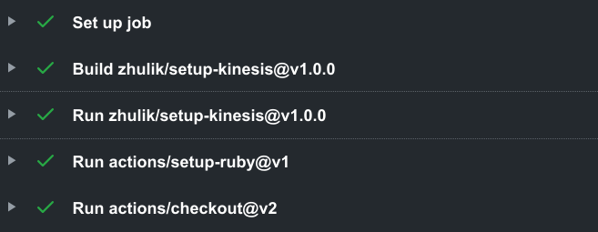

# setup-kinesis

A GitHub action that sets up AWS Kinesis. 

-----



## Example

```.yaml
name: build
on: push

jobs:
  build:
    runs-on: ubuntu-latest
    steps:
      ...
      - uses: zhulik/setup-kinesis@v1.0.2
        with:
          port: 4567
      ...
```

## Contributors

- [mobileka](https://github.com/mobileka)
- [zhulik](https://github.com/zhulik)
